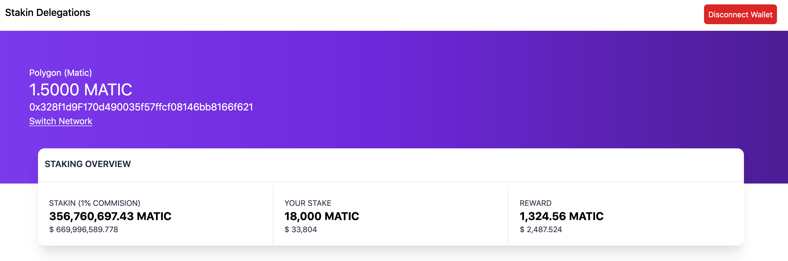
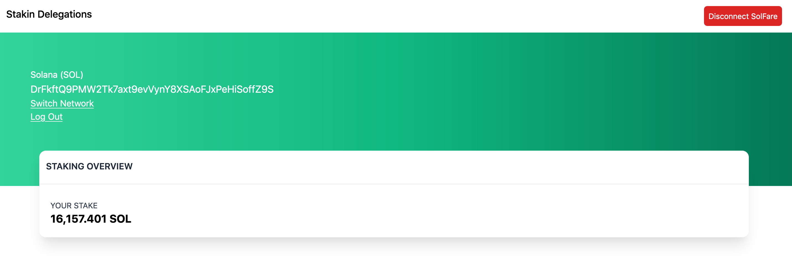

# Stakin Technical Challenge

## Tools and Library Used
FrontEnd
```
VueJS
TailWind CSS
Web3
MetaMask
SolFare Wallet
```

Backend
```
FireBase
PolyGon Matic SmartContract
SolScan Public API
````

## Project setup
```
npm install
```

### Compiles and hot-reloads for development
```
npm run serve
```

### Compiles and minifies for production
```
npm run build
```

### Lints and fixes files
```
npm run lint
```




### Customize configuration
See [Configuration Reference](https://cli.vuejs.org/config/).
